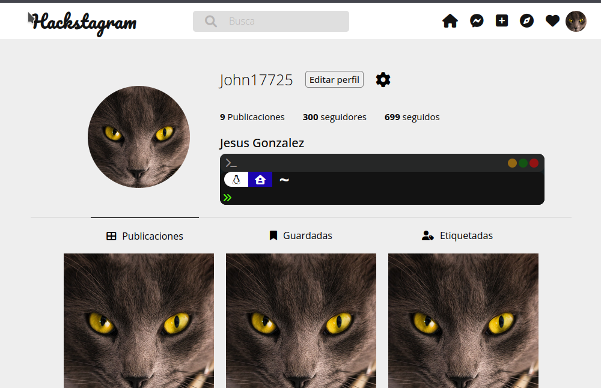

# Mi aprendizaje como Frontend web Developer
En este repositorio encontraran practicas y ejemplos elaborados por mi durante mi aprendizaje de `HTML` y `CSS`.

Para poder darle trazabilidad a mis resultados, he elaborado el siguiente indice para que puedan acceder de forma directa a algunos ejemplos, de igual forma si es de su interes pueden revisar directorio por directorio, aunque la verdad esta bastante desorganizado, la razon del indice.

**Indice**
<ol>
    <li><a href="/class_css/_html_css_/README.md" target="_blank">Introduccion a HTML</a></li>
    <li><a href="/class_css/_html_css_/units_measure/README.md" target="_blank">Introduccion a CSS</a></li>
</ol>

---
## Ejemplos realizados con HTML y CSS

### Tarjeta de presentacion

El codigo de la imagen anterior la encuentras <a href="class_css/_html_css_/Card" target="_blank">Aqui!</a>

---

### CrickoShell
Es una replica de la interfaz `UI` de un terminal

El codigo de la imagen anterior la encuentras <a href="class_css/_html_css_/shell" target="_blank">Aqui!</a>

---

### Hackstagram
Realice una copia de instagram agregando la shell que realice anteriormente dentro de la presentacion de la biografia, flexbox es muy util para re-escalar el contenido, aunque me gustaria empezar a averiguar como reordenar elementos con `responsive design`

De igual forma el codigo `HTML` y `CSS` lo encuentran <a href="class_css/Instagram" target="_blank">Aqui!</a>

---
### Ejemplo de pagina de introduccion y galeria con flexbox

El codigo de la imagen anterior la encuentras <a href="class_css/_clase_5_" target="_blank">Aqui!</a>

---
### Ejemplo de pagina de venta de servicion e introduccion a una empresa / persona ademas de una galeria con flexbox

El codigo de la imagen anterior la encuentras <a href="class_css/_class_6_" target="_blank">Aqui!</a>
