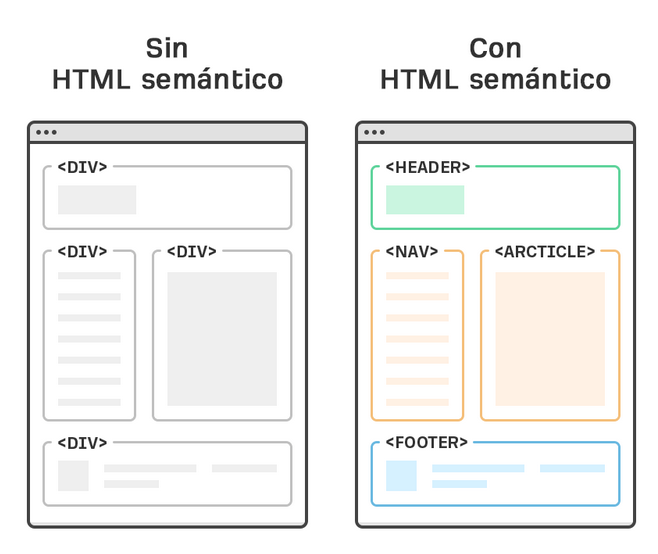

# Notas

## Motores de renderizado
Los motores de renderizado son `Pasar de archivos a pixeles en pantalla`


### Motores de renderizado por navegador

- Chrome    -> BLINK
- EDGE      -> EDGE HTML
- SAFARI    -> WEBKIT
- FIREFOX   -> GECKO
---

### El navegador realiza 5 pasos

- Pasar los archivos a objetos.
- Calcular el estilo correspondiente a cada nodo del DOM.
- Calcula las dimensiones de cada nodo, y donde va en la pantalla
- Pinta las diferentes cajas
- Toma las capas y las convierte en imagen para mostrar en pantalla
---

## Anatomia de un documento HTML

### Elemento  


    <h1>Hola mundo<h1/>

Descripcion del elemento

```
<h1> -> (Etiqueta de apertura)
Hola mundo -> (Contenido)
<h1/> -> (Cierre de etiqueta)
```
---

### Atributos

Etiqueta de apertura
```
<h1 class="title">

class -> Atributo
"title" -> Valor / (Valor del atributo)
```
---
### Anidamiento
Dentro del section tendremos un titulo con un `h1`, posteriormente un texto dentro de la etiqueta `p` y el anidamiento esta dentro del `ul` _Unorder list_ esta etiqueta contiene los `li` _List item_ en cada item habra un texto o elemento

```
<section>
    <h1>Hola</h1>
    <p>Mundo</p>
    <ul>
        <li>Increible</li>
        <li>Maravilla</li>
        <li>Inigualable</li>
    </ul>
</section>
```
---
### Elementos vacios
Son etiquetas que tienen etiqueta de apertura pero sobre la misma es el cierre como en el ejemplo del img
```

```
---
### Anatomia basica de un HTML
```
<!DOCTYPE html>
<html lang="en">
<head>
    <meta charset="UTF-8">
    <meta http-equiv="X-UA-Compatible" content="IE=edge">
    <meta name="viewport" content="width=device-width, initial-scale=1.0">
    <title>Document</title>
</head>
<body>
    
</body>
</html>
```
---
### HTML Semantico
El HTML Semantico sugiere el uso de las etiquetas `main` para el contenido principal, `section` para secciones en particular, `article` para articulos, `footer` para la descripcion o pie de pagina, con el fin de mejorar el posicionamiento web **SEO**.

Mientras que el HTML no semantico, solo hace uso de los `div` agregando **atributos** como el `class` para poder identificarlos con **valores** como los descritos anteriormente `article`, `main`, `section`.. etc.



---
